# Host Flutter on Firebase
Guide how to host a Flutter project on Firebase 

## Step 1 : Create a project on Firebase 
  
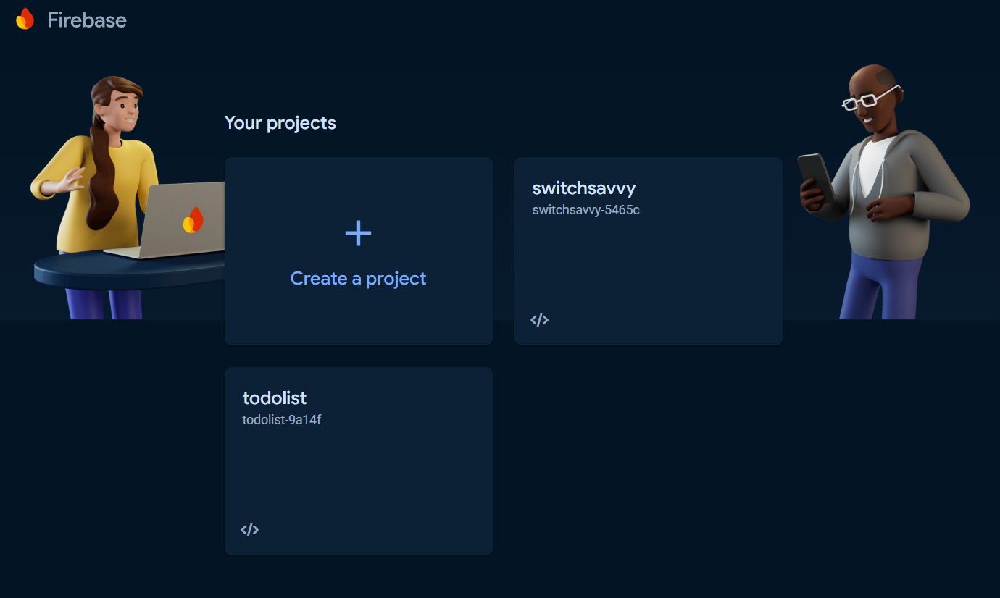
  

## Step 2 : Open the file on the command prompt 
  
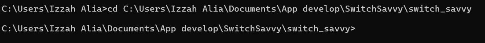

## Step 3 : Install Firebase 
  
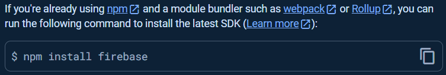

  
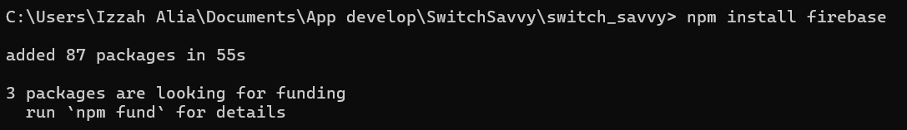

## Step 4 : Login Firebase 
Type 'firebase login'  
  
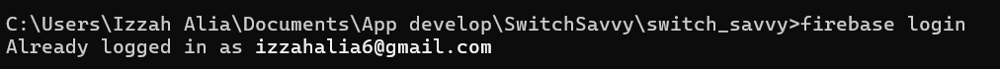
  

## Step 5 : Initialize Firebase 
Type 'firebase init'  
  
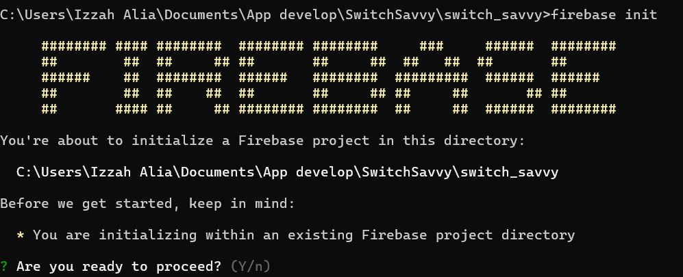
  

## Step 6 : Build a web file for Flutter 
Select 'n', then type 'flutter build web'  
  
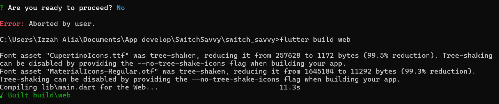
  
After that, retype 'firebase init'  

## Step 7 : Select Firebase feature 
Enter the spacebar to select  
  
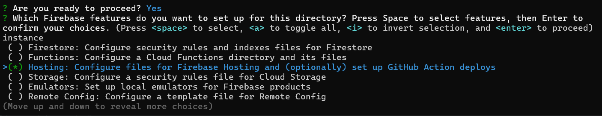
   

## Step 8 : Complete Firebase initialization 
  
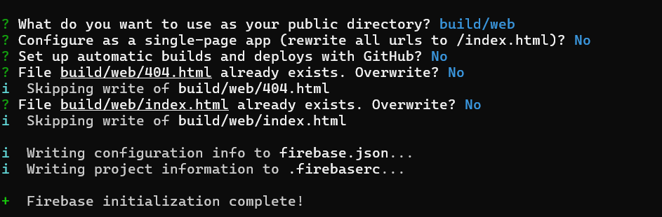
   

## Step 9 : Complete Hosting 
Type 'firebase deploy' to deploy the web file  
  
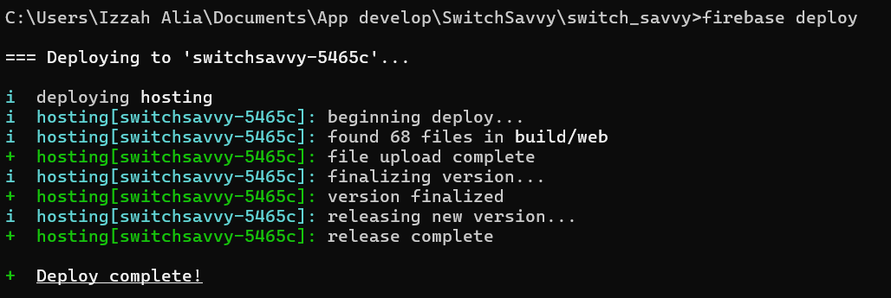
   

## Step 10 : Copy the hosting URL 
  
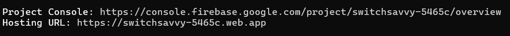
  
Use Control + Shift + m to toggle the tab key moving focus. Alternatively, use esc then tab to move to the next interactive element on the page.
No file chosen
Attach files by dragging & dropping, selecting or pasting them.
Editing HostFlutterOnFirebase/README.md at main · oishylea/HostFlutterOnFirebase
